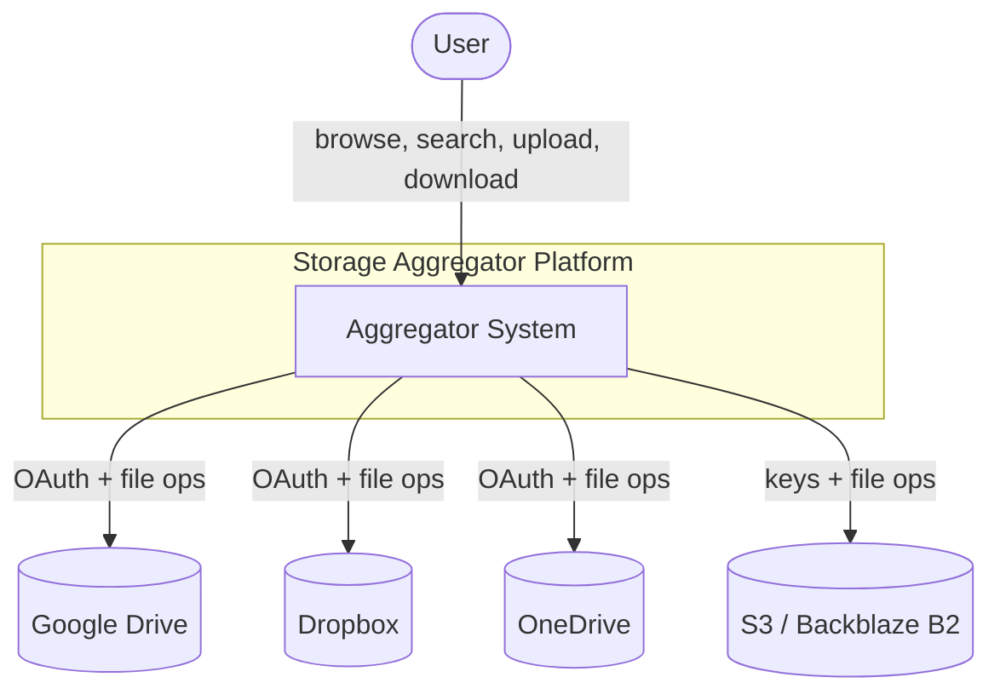
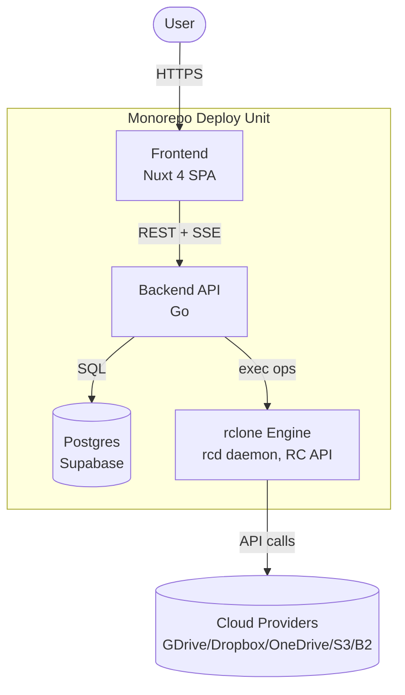
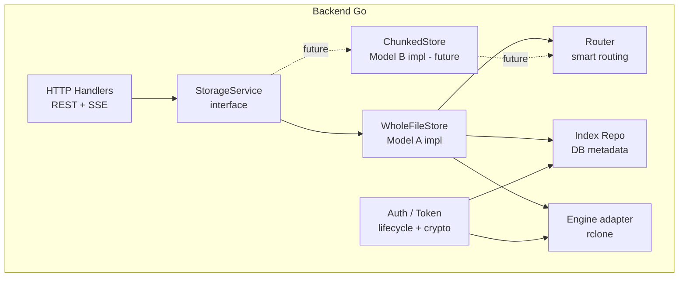

# 01 — Software Architecture Document (SAD)

## 1. Tujuan & Konteks
Menghilangkan fragmentasi storage: user punya banyak akun cloud gratis dengan kapasitas
total besar namun terpisah-pisah. Platform ini menyatukannya jadi satu view: browse,
search, upload (auto-route), download — tanpa peduli file fisik ada di akun/provider mana.

## 2. Prinsip Arsitektur
1. **Engine-agnostic.** Operasi file disembunyikan di balik interface; rclone hanya salah satu implementasi.
2. **Storage-model-agnostic.** UI & API tak tahu file itu whole (A) atau chunked (B).
3. **Metadata di DB, file di provider.** Server tak menyimpan file permanen (stream-through).
4. **Multi-tenant sejak awal.** `user_id` ada di skema walau v1 single-user.
5. **Self-hostable.** Seluruh sistem jalan via Docker Compose.

## 3. C4 — Level 1: System Context

## 4. C4 — Level 2: Container

## 5. C4 — Level 3: Component (Backend)

## 6. Aliran Data Inti
- **Connect:** User → FE → BE (`/accounts/connect`) → OAuth via engine → token disimpan (encrypted) di DB.
- **Index sync:** BE `List` per account via engine → tulis metadata ke `files_index`/`file_blocks`.
- **Browse/Search:** FE → BE → baca dari DB (cepat, tak hit provider) → render explorer.
- **Upload:** FE stream → BE → Router pilih account → engine `UploadStream` → catat index.
- **Download:** FE minta → BE engine `Download` (stream-through) → pipe ke FE.

## 7. Model A → Model B (Scalability)
Titik abstraksi: `StorageService`. Skema DB `file_blocks` sudah menampung 1..N block per file.

| Elemen | Model A | Model B | Berubah? |
|--------|---------|---------|----------|
| UI / REST API | sama | sama | ❌ |
| Skema DB | 1 block/file | N block/file | ❌ (struktur), ✅ (isi) |
| StorageService impl | WholeFileStore | ChunkedStore | ✅ (tambah impl) |
| Router | pick 1 account | pick N account | ➕ (extend) |
| Modul baru | — | Splitter + reassembler | ➕ |
| Engine (rclone) | sama | sama | ❌ |

Upgrade file A→B = baca utuh → pecah → sebar → tulis N `file_blocks` → set `is_chunked=true`. Reversible.

## 8. Kualitas Atribut
- **Security:** token AES-GCM at-rest; scope OAuth minimal; file tak persist di server.
- **Performance:** browse/search dari DB cache < 2 dtk; upload/download stream (bukan buffer penuh).
- **Extensibility:** provider baru = 1 remote rclone, tanpa sentuh UI/DB.
- **Portability:** Docker Compose, env-driven config.
- **Reliability:** operasi idempotent; retry backoff pada error transient; incremental sync.

## 9. Batasan & Asumsi
- rclone berjalan sebagai daemon RC terpisah di jaringan privat, hanya dijangkau backend (ADR-011).
- Provider yang dipakai mendukung `about` (quota) — jika tidak, kapasitas ditandai unknown.
- v1: operasi manajemen (bukan sync-daemon dua arah realtime).
