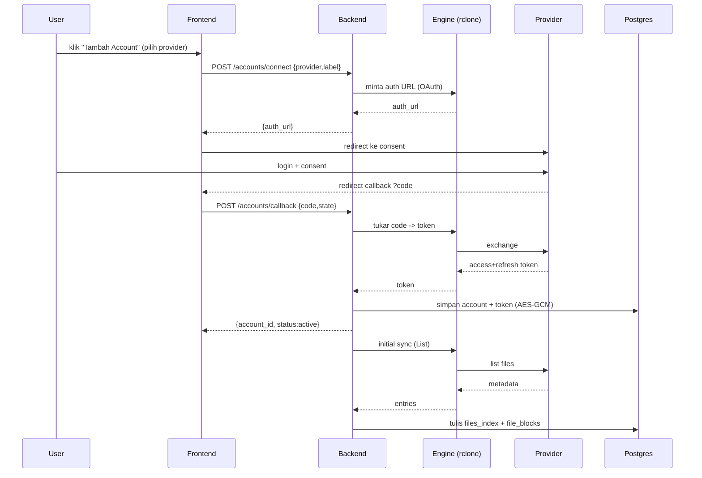
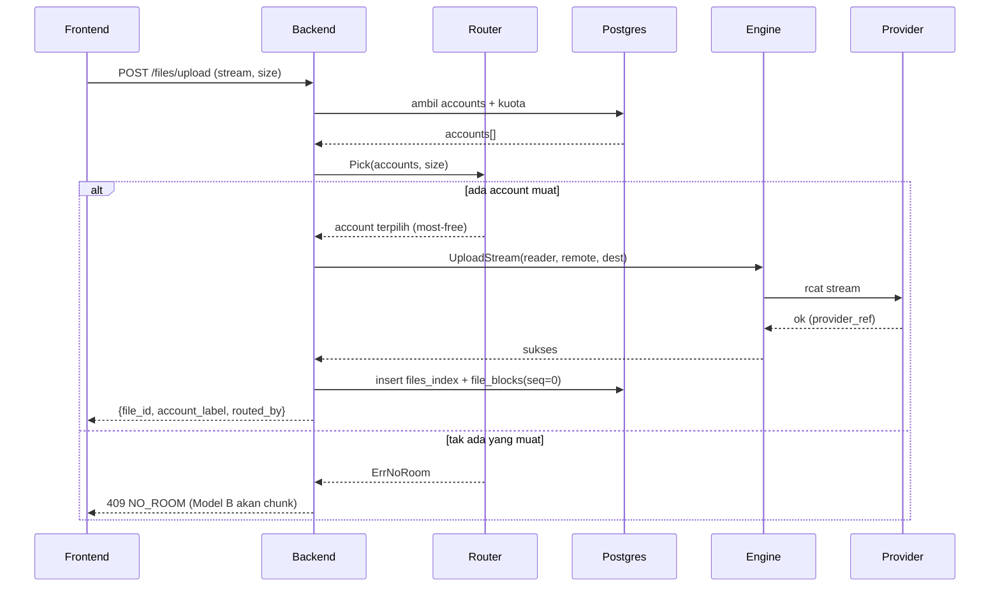
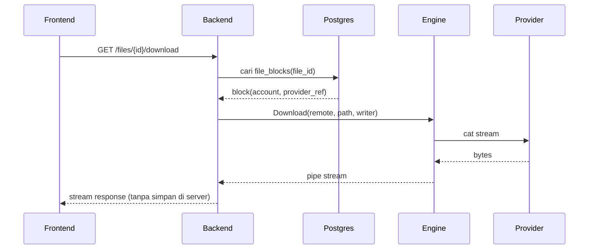
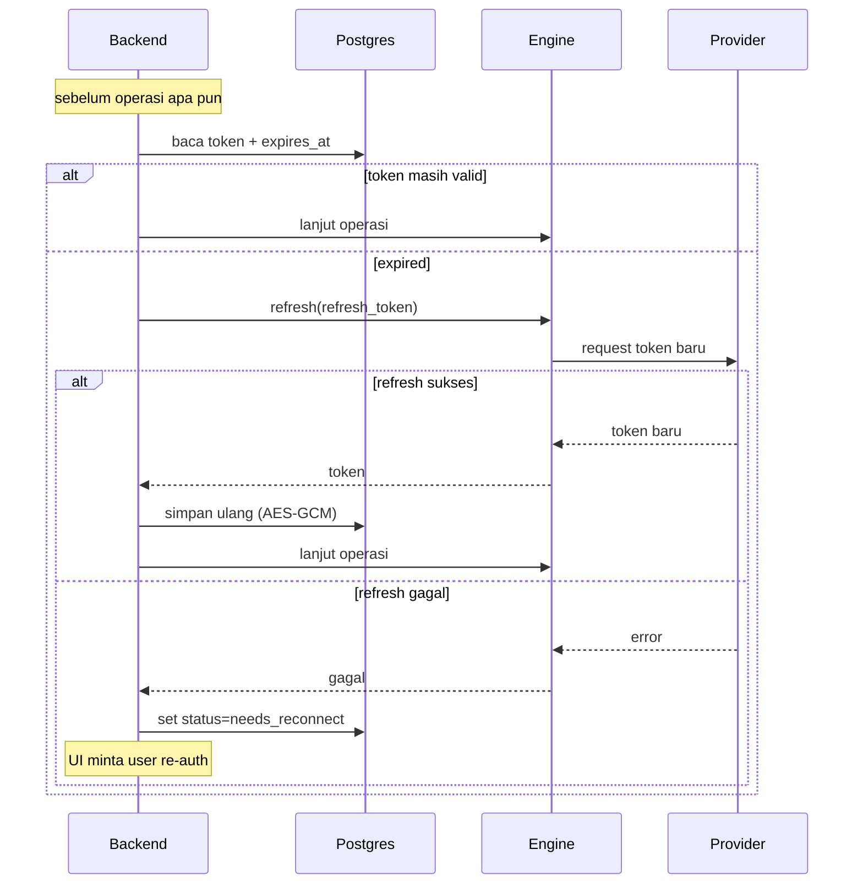

# 07 — Sequence Flows

## 1. Connect Account (OAuth)


## 2. Upload + Smart Routing (Model A)


## 3. Download (Stream-Through)


## 4. Token Refresh (Lifecycle)


## 5. (Future) Upgrade File A → B
```mermaid
sequenceDiagram
    participant BE as Backend
    participant WS as WholeFileStore
    participant SP as Splitter
    participant R as Router
    participant EN as Engine
    participant DB as Postgres

    BE->>WS: baca file utuh (Model A)
    WS-->>BE: stream
    BE->>SP: pecah + (encrypt) -> N chunk
    loop tiap chunk
        BE->>R: Pick(accounts, chunkSize)
        R-->>BE: account
        BE->>EN: UploadStream(chunk)
    end
    BE->>DB: tulis N file_blocks(seq=0..N-1)
    BE->>DB: set files_index.is_chunked=true
    Note over BE: hapus objek lama; reversible
```
